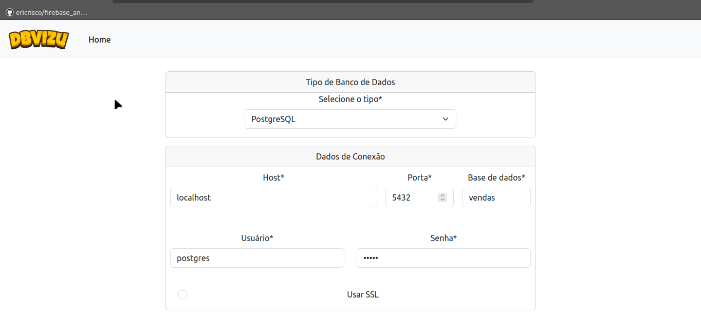
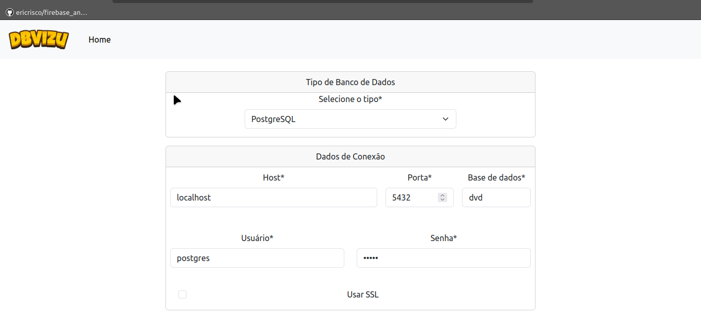

# DBVizu

Este projeto foi idealizado na disciplina 45PBD - Persistência de Dados no curso de Engenharia de Software - UDESC/CEAVI.

O projeto consiste em uma aplicação que receba dados de conexão de um determinado banco de dados, e faça a engenharia reversa, gerando um diagrama de representação das tabelas e seus atributos, assim como seus relacionamentos (foreign key) e as chaves primárias (primary key).

> ⚠️ Compatível apenas com PostgreSQL até o momento.


## Stack utilizada

**Front-end:** Django Templates

**Back-end:** Python, Django


## Demonstração



---




## Rodando localmente

Clone o projeto

```bash
  git clone https://github.com/cesarfreire/45pbd-dbvizu.git
```

Entre no diretório do projeto

```bash
  cd 45pbd-dbvizu/
```

Crie um ambiente virtual do Python e ative:

```bash
  python3 -m venv .venv
  source .venv/bin/activate
```

Instale as dependências

```bash
  pip install -r requirements.txt
```

Execute as migrations

```bash
  python manage.py makemigrations
  python manage.py migrate
```

Crie o diretório onde as imagens são armazenadas

```bash
  mkdir /tmp/media
```

Execute o servidor localmente

```bash
  python manage.py runserver
```


